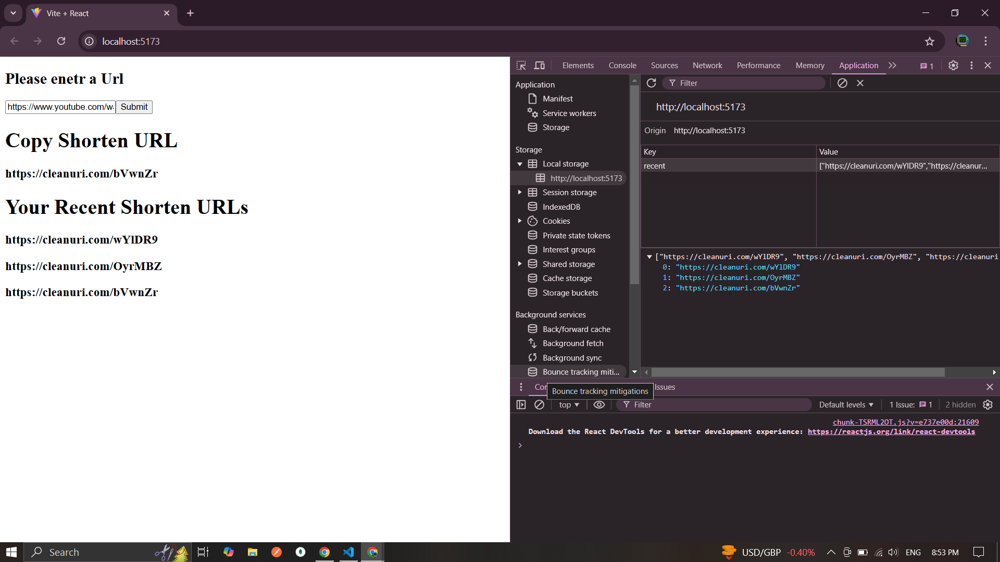
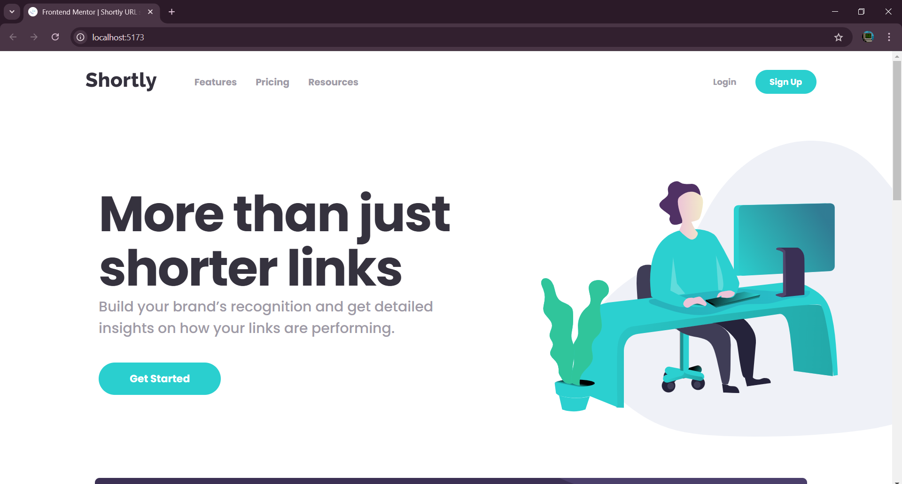
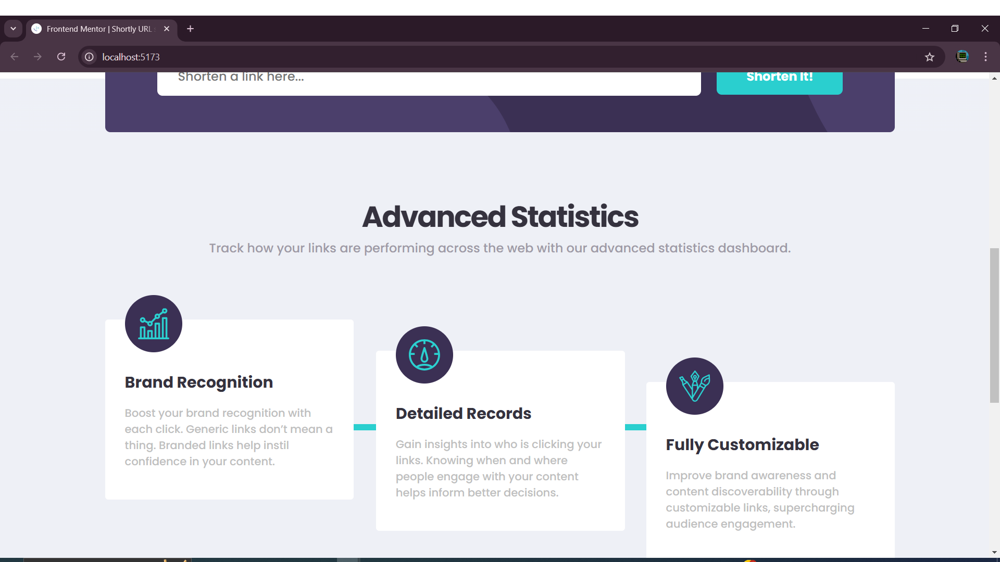

# Frontend Mentor - Shortly URL shortening API Challenge solution

This is a solution to the [Shortly URL shortening API Challenge challenge on Frontend Mentor](https://www.frontendmentor.io/challenges/url-shortening-api-landing-page-2ce3ob-G). Frontend Mentor challenges help you improve your coding skills by building realistic projects. 

#### Check Out My Solution [Here](https://url-shortner-aqdaojnvf-zia-alams-projects.vercel.app/)

## Table of contents

- [Overview](#overview)
  - [The challenge](#the-challenge)
  - [Screenshot](#screenshot)
  - [Links](#links)
- [My process](#my-process)
  - [Built with](#built-with)
  - [What I learned](#what-i-learned)
- [Author](#author)

## Overview

### The challenge

Users should be able to:

- View the optimal layout for the site depending on their device's screen size
- Shorten any valid URL
- See a list of their shortened links, even after refreshing the browser
- Copy the shortened link to their clipboard in a single click
- Receive an error message when the `form` is submitted if:
  - The `input` field is empty

### Screenshot

### Links

- Solution URL: [Add solution URL here](https://github.com/ZiaAlam7/URL_Shortner_Api)
- Live Site URL: [Add live site URL here](https://url-shortner-aqdaojnvf-zia-alams-projects.vercel.app/)

## My process

### Built with

- Semantic HTML5 markup
- CSS custom properties
- Flexbox
- CSS Grid
- [React](https://reactjs.org/) - JS library

### What I learned

The API Provided By Frontend Mentor Had Cors Issue Due To Which I Created A Backend Serve That Took The URL From Front End And Then Send That Data To The API And The Response Of API Was Send Back To The Frontend I Took Me Some Hours To Build That, But Then A Friend Told Me To Use Another API, One That Is Public And Free So I Used Tiny URL Which Didn't Had Any CORS Issues And I Sent The URL Directly From The Frontend Backend Was Not Required.

## Author

- Frontend Mentor - [@ZiaAlam7](https://www.frontendmentor.io/profile/ZiaAlam7)
- LinkedIn - [Zia Alam](https://www.linkedin.com/in/zia-alam-102572227/)

